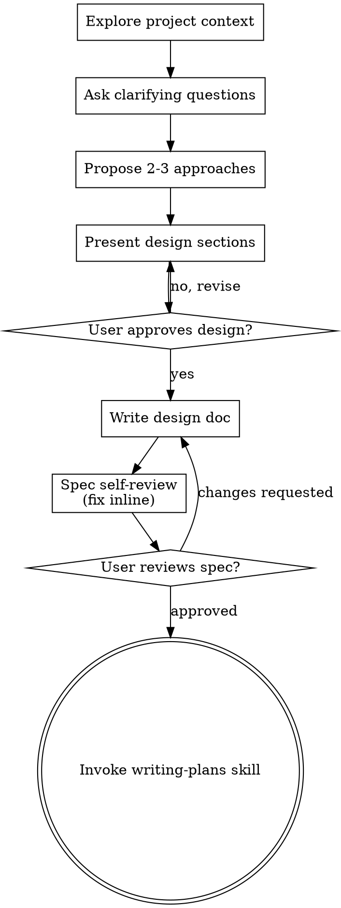

# 通过头脑风暴将想法转化为设计

通过自然的协作对话，帮助将想法转化为完整的设计和规格说明。

首先了解当前项目背景，然后逐一提出问题以完善想法。在理解你要构建的内容后，呈现设计并获得用户批准。

<HARD-GATE>
在呈现设计并获得用户批准之前，不得调用任何实施技能、编写任何代码、搭建任何项目或采取任何实施行动。这适用于每个项目，无论其看似多么简单。
</HARD-GATE>

## 反模式："这个太简单了，不需要设计"

每个项目都要经过这个过程。待办事项列表、单一功能工具、配置更改——无一例外。"简单"的项目正是未经检验的假设造成最多浪费工作的地方。设计可以很简短（对于真正简单的项目只需几句话），但你必须呈现它并获得批准。

## 检查清单

你必须为以下每一项创建任务并按顺序完成：

1. **探索项目背景** — 检查文件、文档、最近的提交
2. **在恰当时机提供可视化伴侣** — 而不是一开始就提供。当某个问题通过展示比通过描述更清晰时，在那一刻提供它（单独一条消息）；获得批准后，其浏览器标签页会为你打开。如果从未出现可视化问题，则永远不要提供。请参见下方 Visual Companion（可视化伴侣）部分。
3. **提出澄清问题** — 一次一个，理解目的、约束、成功标准
4. **提出2-3种方案** — 附带权衡评估和你的推荐
5. **呈现设计** — 按复杂度划分章节，每部分获得用户批准
6. **编写设计文档** — 保存到 `docs/superpowers/specs/YYYY-MM-DD-<topic>-design.md` 并提交
7. **规格自审** — 快速内联检查占位符、矛盾、歧义、范围（见下文）
8. **用户审查书面规格** — 在继续前请用户审查规格文件
9. **过渡到实施** — 调用 writing-plans 技能创建实施计划

## 流程

**终端状态是调用 writing-plans。** 不要调用 frontend-design、mcp-builder 或任何其他实施技能。头脑风暴之后唯一调用的技能是 writing-plans。

## 流程详解

**理解想法：**

- 首先检查当前项目状态（文件、文档、最近的提交）
- 在提出详细问题之前，评估范围：如果请求描述了多个独立的子系统（例如，"构建一个包含聊天、文件存储、计费和分析的平台"），立即标记出来。不要在需要先分解的项目上花费时间细化细节。
- 如果项目对一个规格说明来说过于庞大，帮助用户分解为子项目：哪些是独立的部分，它们之间如何关联，应该按什么顺序构建？然后通过正常的设计流程对第一个子项目进行头脑风暴。每个子项目都有自己的规格→计划→实施周期。
- 对于范围适当的项目，逐一提出问题以完善想法
- 尽可能优先使用选择题，但开放式问题也可以
- 每条消息只提一个问题——如果某个主题需要更多探索，将其拆分为多个问题
- 专注于理解：目的、约束、成功标准

**探索方案：**

- 提出2-3种不同的方案，附带权衡评估
- 以对话方式呈现选项，附上你的推荐和理由
- 先提出你的推荐选项并解释原因

**呈现设计：**

- 一旦你确信理解了要构建的内容，就呈现设计
- 根据复杂度调整每个章节的篇幅：简单的章节几句话，复杂的章节可达200-300字
- 每章之后询问是否看起来正确
- 涵盖：架构、组件、数据流、错误处理、测试
- 如果有不清晰的地方，准备好回溯澄清

**为隔离性和清晰性而设计：**

- 将系统分解为更小的单元，每个单元有单一明确的目的，通过定义良好的接口通信，并能独立理解和测试
- 对于每个单元，你应该能回答：它做什么，如何使用它，它依赖什么？
- 是否能在不阅读内部实现的情况下理解一个单元的功能？能否在不破坏使用方的情况下更改内部实现？如果不能，边界需要调整。
- 更小、边界清晰的单元也更易于你处理——你能更好地推理同时能放在上下文中的代码，当文件聚焦时你的编辑也更可靠。当文件变得庞大时，这通常是一个信号，表明它做得太多了。

**在现有代码库中工作：**

- 在提出更改之前先探索当前结构。遵循现有模式。
- 如果现有代码存在影响工作的问题（例如，文件过于庞大、边界不清、职责纠缠），将针对性的改进作为设计的一部分——就像好的开发者在工作中改进代码一样。
- 不要提出无关的重构。专注于服务于当前目标的内容。

## 设计之后

**文档化：**

- 将验证后的设计（规格）写入 `docs/superpowers/specs/YYYY-MM-DD-<topic>-design.md`
  - （用户对规格位置的偏好会覆盖此默认值）
- 如果可用，使用 elements-of-style:writing-clearly-and-concisely 技能
- 将设计文档提交到 git

**规格自审：**
编写规格文档后，以全新视角审视它：

1. **占位符扫描：** 是否有"待定"、"待办"、不完整的章节或模糊的需求？修复它们。
2. **内部一致性：** 是否有章节相互矛盾？架构是否与功能描述匹配？
3. **范围检查：** 这对单个实施计划来说是否足够聚焦，还是需要进一步分解？
4. **歧义检查：** 是否有任何需求可以被两种不同方式解读？如果有，选择一个并明确说明。

内联修复任何问题。无需重新审查——只需修复并继续。

**用户审查关口：**
规格审查循环通过后，在继续前请用户审查书面规格：

> "规格已编写并提交到 `<path>`。请审查，如有任何修改意见请告知，然后我们再开始编写实施计划。"

等待用户回应。如果他们要求修改，进行修改并重新运行规格审查循环。只有在用户批准后才能继续。

**实施：**

- 调用 writing-plans 技能创建详细的实施计划
- 不要调用任何其他技能。writing-plans 是下一步。

## 关键原则

- **一次一个问题** - 不要用多个问题让人应接不暇
- **优先选择题** - 在可能的情况下比开放式问题更容易回答
- **无情地YAGNI** - 从所有设计中移除不必要的功能
- **探索替代方案** - 在确定前总是提出2-3种方案
- **渐进式验证** - 呈现设计，获得批准后再继续
- **保持灵活** - 当某些内容不清晰时，回溯澄清

## 可视化伴侣（Visual Companion）

一个基于浏览器的伴侣，用于在头脑风暴期间展示模拟图、图表和可视化选项。作为一个工具提供——而不是一种模式。接受 Visual Companion 意味着它可用于那些受益于可视化处理的问题；这并不意味着每个问题都要通过浏览器进行。

**提供伴侣（恰当时机）：** 不要一开始就提供它。等到某个问题通过展示比通过描述更清晰时——一个真正的模拟图/布局/图表问题，而不仅仅是UI主题。当那第一次发生时，在那一刻提供它，作为单独的消息：
> "下一部分可能更容易通过展示来解释——我可以在浏览器标签页中准备好模拟图、图表和对比，我们边聊边看。它还是新功能且消耗令牌较多。需要我打开吗？我会为你打开它。"

**这个提议必须是单独的消息。** 只有提议——没有澄清问题、总结或其他内容。等待用户回应。如果他们接受，用 `--open` 启动服务器，让浏览器自动打开到第一个画面。如果他们拒绝，继续纯文本交流，除非他们主动提起，否则不再提供。

**逐问题决定：** 即使在接受后，也要为每个问题决定是使用浏览器还是终端。判断标准：**用户通过视觉比通过阅读能更好地理解这个问题吗？**

- **使用浏览器** 处理本质上是视觉的内容——模拟图、线框图、布局对比、架构图、并排视觉设计
- **使用终端** 处理文本内容——需求问题、概念选择、权衡列表、A/B/C/D文本选项、范围决策

关于UI主题的问题不自动等于视觉问题。"在这个上下文中，个性意味着什么？"是一个概念性问题——使用终端。"哪种向导布局更好？"是一个视觉性问题——使用浏览器。

如果他们同意使用 Visual Companion，在继续前阅读详细指南：
`skills/brainstorming/visual-companion.md`
