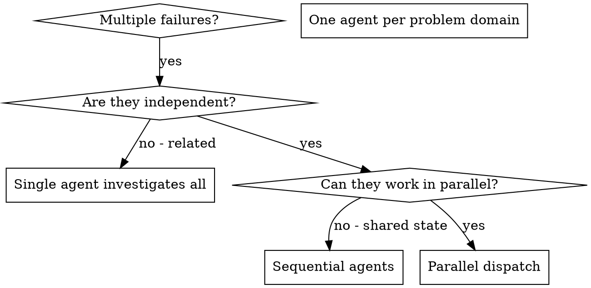

# 派发并行 Agent

## 概述

你将任务委派给具有隔离上下文的专门 agent。通过精确构建它们的指令和上下文，确保它们保持专注并成功完成任务。它们永远不应继承你会话的上下文或历史——你只需构建它们所需的内容。这也为你保留了协调工作的上下文。

当你有多个不相关的失败（不同测试文件、不同子系统、不同 bug）时，逐个调查会浪费时间。每个调查都是独立的，可以同时进行。

**核心原则：** 每个独立的问题域派发一个 agent。让它们并发工作。

## 何时使用



**使用场景：**
- 3个以上测试文件因不同的根因而失败
- 多个子系统独立损坏
- 每个问题可以独立理解，无需其他问题的上下文
- 调查之间没有共享状态

**不使用场景：**
- 失败是相关的（修复一个可能会修复其他的）
- 需要了解完整的系统状态
- Agent 会相互干扰

## 模式

### 1. 识别独立的问题域

按损坏的内容将失败分组：
- 文件A的测试：工具批准流程
- 文件B的测试：批量完成行为
- 文件C的测试：中止功能

每个域都是独立的——修复工具批准流程不会影响中止功能的测试。

### 2. 创建聚焦的 Agent 任务

每个 agent 获得：
- **具体范围：** 一个测试文件或子系统
- **明确目标：** 让这些测试通过
- **约束：** 不要修改其他代码
- **期望输出：** 发现和修复内容的总结

### 3. 并行派发

在同一次回复中发出所有三个 subagent 派发——它们并行运行：

```text
Subagent (general-purpose): "Fix agent-tool-abort.test.ts failures"
Subagent (general-purpose): "Fix batch-completion-behavior.test.ts failures"
Subagent (general-purpose): "Fix tool-approval-race-conditions.test.ts failures"
# All three run concurrently.
```

一次回复中的多个派发调用 = 并行执行。每次回复一个 = 顺序执行。

### 4. 审查并整合

当 agent 返回时：
- 阅读每个总结
- 验证修复不冲突
- 运行完整测试套件
- 整合所有更改

## Agent 提示词结构

好的 agent 提示词是：
1. **聚焦的** — 一个明确的问题域
2. **自包含的** — 理解问题所需的所有上下文
3. **输出具体的** — agent 应该返回什么？

```markdown
Fix the 3 failing tests in src/agents/agent-tool-abort.test.ts:

1. "should abort tool with partial output capture" - expects 'interrupted at' in message
2. "should handle mixed completed and aborted tools" - fast tool aborted instead of completed
3. "should properly track pendingToolCount" - expects 3 results but gets 0

These are timing/race condition issues. Your task:

1. Read the test file and understand what each test verifies
2. Identify root cause - timing issues or actual bugs?
3. Fix by:
   - Replacing arbitrary timeouts with event-based waiting
   - Fixing bugs in abort implementation if found
   - Adjusting test expectations if testing changed behavior

Do NOT just increase timeouts - find the real issue.

Return: Summary of what you found and what you fixed.
```

## 常见错误

**❌ 太宽泛：** "修复所有测试" — agent 会迷失方向
**✅ 具体：** "修复 agent-tool-abort.test.ts" — 聚焦的范围

**❌ 没有上下文：** "修复竞态条件" — agent 不知道在哪里
**✅ 有上下文：** 粘贴错误消息和测试名称

**❌ 没有约束：** Agent 可能会重构所有内容
**✅ 有约束：** "不要修改生产代码" 或 "仅修复测试"

**❌ 模糊的输出：** "修复它" — 你不知道改了什么
**✅ 具体的：** "返回根因和更改的总结"

## 何时不使用

**相关的失败：** 修复一个可能会修复其他的——先一起调查
**需要完整上下文：** 理解需要看到整个系统
**探索性调试：** 你还不知道哪里坏了
**共享状态：** Agent 会相互干扰（编辑相同的文件、使用相同的资源）

## 来自会话的真实示例

**场景：** 大规模重构后3个文件中6个测试失败

**失败：**
- agent-tool-abort.test.ts：3个失败（时序问题）
- batch-completion-behavior.test.ts：2个失败（工具未执行）
- tool-approval-race-conditions.test.ts：1个失败（执行计数 = 0）

**决策：** 独立的问题域——中止逻辑与批量完成与竞态条件相互独立

**派发：**
```
Agent 1 → Fix agent-tool-abort.test.ts
Agent 2 → Fix batch-completion-behavior.test.ts
Agent 3 → Fix tool-approval-race-conditions.test.ts
```

**结果：**
- Agent 1：用基于事件的等待替换超时
- Agent 2：修复了事件结构 bug（threadId 放在了错误的位置）
- Agent 3：添加了对异步工具执行完成的等待

**整合：** 所有修复独立，无冲突，完整套件通过

**节省的时间：** 3个问题并行解决而非顺序进行

## 关键优势

1. **并行化** — 多个调查同时进行
2. **聚焦** — 每个 agent 有狭窄的范围，需要追踪的上下文更少
3. **独立性** — Agent 不会相互干扰
4. **速度** — 3个问题在1个的时间内解决

## 验证

Agent 返回后：
1. **审查每个总结** — 理解改了什么
2. **检查冲突** — Agent 是否编辑了相同的代码？
3. **运行完整套件** — 验证所有修复可以一起工作
4. **抽查** — Agent 可能犯系统性错误

## 实际影响

来自调试会话（2025-10-03）：
- 3个文件中的6个失败
- 并行派发3个 agent
- 所有调查同时完成
- 所有修复成功整合
- Agent 更改之间零冲突
