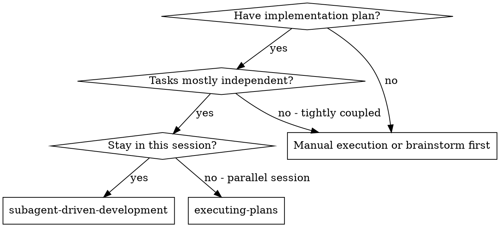
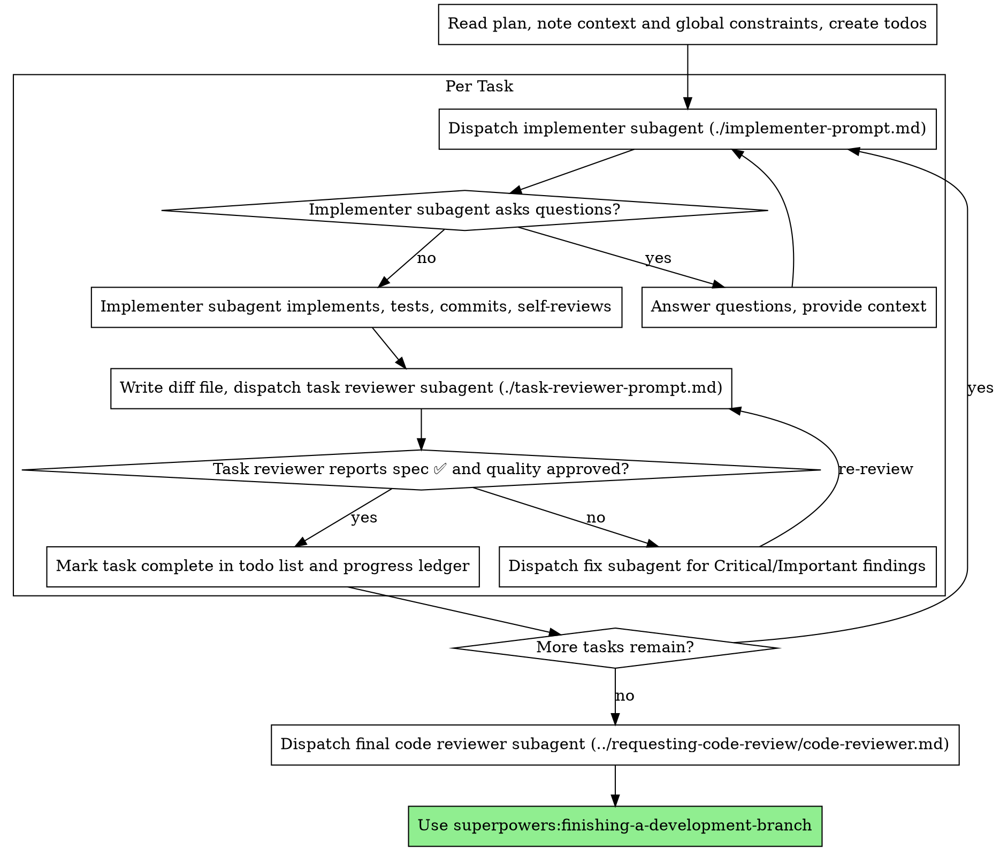

# 子代理驱动开发

通过为每个任务调度新的实施者子代理、每个任务后进行一次任务审阅（规格符合性 + 代码质量）、最后进行一次全面的全分支审阅来执行方案。

**为什么用子代理：** 你将任务委托给拥有独立上下文的专门化代理。通过精确构建它们的指令和上下文，你确保它们保持专注并成功完成任务。它们绝不应继承你的会话上下文或历史——你精确构造它们所需的一切。这也为你保留了用于协调工作的上下文。

**核心原则：** 每个任务使用新的子代理 + 任务审阅（规格 + 质量）+ 全面的最终审阅 = 高质量、快速迭代

**叙述：** 在工具调用之间，最多叙述一行简短说明——账本和工具结果承载着记录。

**持续执行：** 不要在任务之间停下来与你的 human partner（人类搭档）确认。不间断地执行方案中的所有任务。唯一需要停止的原因是：你无法解决的 BLOCKED 状态、确实阻碍进展的歧义、或所有任务已完成。"我该继续吗？"的提示和进度总结是在浪费他们的时间——他们让你执行方案，那就执行它。

## 何时使用



**相比执行方案（并行会话）：**
- 同一会话（无需上下文切换）
- 每个任务使用新的子代理（无上下文污染）
- 每个任务后进行审阅（规格符合性 + 代码质量），最后进行全面审阅
- 更快迭代（任务之间无人工介入）

## 流程



## 方案预检

在调度任务 1 之前，扫描方案一次以检查冲突：

- 互相矛盾的任务，或与方案的全局约束冲突的任务
- 方案明确要求但审阅标准视为缺陷的内容（如不验证任何内容的测试、逐字复制的逻辑块）

将你发现的所有内容作为一批打包问题呈现给你的 human partner——每个发现旁边附上要求它的方案原文，询问哪个为准——在执行开始前完成，而不是在方案执行中途每次发现一个就打断一次。如果扫描结果干净，直接继续，无需评论。审阅循环仍然是捕获那些只在实施中才暴露的冲突的网。

## 模型选择

使用能胜任每个角色的最弱模型以节约成本并提高速度。

**机械性实施任务**（独立函数、清晰规格、1-2 个文件）：使用快速、便宜的模型。当方案规定明确时，大多数实施任务都是机械性的。

**集成和判断任务**（多文件协调、模式匹配、调试）：使用标准模型。

**架构和设计任务**：使用最强大的可用模型。最终的全分支审阅就是其中之一——使用最强大的可用模型调度，而不是会话默认模型。

**审阅任务**：根据差异文件的大小、复杂性和风险，选择具有相同判断力的模型。一个小的机械性差异不需要最强大的模型；而一个微妙的并发变更则需要。

**在调度子代理时始终明确指定模型。** 不指定模型将继承你会话的模型——通常是最强大也最昂贵的——这会在不知不觉中违背本节的意图。

**轮次成本超过 Token 价格。** 实际时间和上下文成本取决于子代理花费多少轮次，而最便宜的模型在多步骤工作上通常需要 2-3 倍的轮次——总体成本更高。对于审阅者以及根据文字描述工作的实施者，使用中档模型作为下限。当任务方案文本包含要编写的完整代码时，实施就是抄写加测试：为该实施者使用最便宜的层级。单文件机械性修复也使用最便宜的层级。

**任务复杂性信号（实施任务）：**
- 涉及 1-2 个文件且有完整规格 → 便宜模型
- 涉及多个文件且有集成问题 → 标准模型
- 需要设计判断或广泛代码库理解 → 最强大模型

## 处理实施者状态

实施者子代理会报告四种状态之一。分别处理每种状态：

**DONE：** 生成审阅包（`scripts/review-package BASE HEAD`，从本技能目录运行——它会打印它写入的唯一文件路径；BASE 是在调度实施者之前记录的提交——绝不能是 `HEAD~1`，这会静默丢弃多提交任务中除最后一个之外的所有提交），然后用打印的路径调度任务审阅者。

**DONE_WITH_CONCERNS：** 实施者完成了工作但对某些方面有疑虑。在继续之前阅读这些疑虑。如果疑虑涉及正确性或范围，在审阅之前处理它们。如果只是观察意见（例如"这个文件变得很大了"），记录下来然后继续到审阅。

**NEEDS_CONTEXT：** 实施者需要未提供的信息。提供缺失的上下文并重新调度。

**BLOCKED：** 实施者无法完成任务。评估阻塞因素：
1. 如果是上下文问题，提供更多上下文并使用相同模型重新调度
2. 如果任务需要更多推理，使用更强大的模型重新调度
3. 如果任务太大，拆分成更小的部分
4. 如果方案本身有误，升级给人类处理

**绝不能**忽略升级或强制相同模型不做更改地重试。如果实施者说它卡住了，有些事情必须改变。

## 处理审阅者 ⚠️ 项

任务审阅者可能会报告"⚠️ 无法从差异中验证"的项——存在于未更改代码中或跨任务的要求。这些不会阻塞审阅的其余部分，但在标记任务完成之前，你必须自己解决每一项：你拥有审阅者所缺乏的方案和跨任务上下文。如果你确认某项确实存在差距，将其视为规格审阅失败——将其发回给实施者并重新审阅。

## 构建审阅者提示

每个任务的审阅是任务范围的关卡。全面审阅只进行一次，在最终的全分支审阅时。当你填写审阅者模板时：

- 除非有具体、任务特定的原因，否则不要添加开放式的指令，如"检查所有用法"或"如果有用则运行竞态测试"
- 不要要求审阅者重新运行实施者已在相同代码上运行过的测试——实施者的报告携带了测试证据
- 不要预判审阅者的发现结果——绝不要指示审阅者忽略或不标记特定问题。如果你认为某发现会是误报，让审阅者提出它并在审阅循环中裁决。如果你正在写的提示包含"不要标记"、"不要将 X 视为缺陷"、"最多 Minor"或"方案选择了"——停下来：你在预判结果，通常是为了省去一次审阅循环。
- 你交给审阅者的全局约束块是它的注意力透镜。从方案的全局约束部分或规格中逐字复制绑定要求：精确值、精确格式、以及声明的组件间关系（"与 X 相同布局"、"匹配 Y"）。审阅者的模板已经携带了流程规则（YAGNI、测试卫生、审阅方法）——约束块是给这个项目的规格所要求的内容。
- 将差异文件作为文件交给审阅者：运行本技能的 `scripts/review-package BASE HEAD` 并将打印的文件路径传给审阅者（或者，在没有 bash 的情况下：在该范围内使用 `git log --oneline`、`git diff --stat` 和 `git diff -U10`，重定向到一个唯一命名的文件中）。输出永远不会进入你自己的上下文，审阅者通过一次 Read 调用即可看到提交列表、统计摘要和带有上下文的完整差异。使用你在调度实施者之前记录的 BASE——绝不能使用 `HEAD~1`，它会静默截断多提交任务。
- 一个调度提示描述一个任务，而不是会话的历史。不要将累积的前置任务摘要（"任务 1-3 之后的状态"）粘贴到后续调度中——一个真实会话的调度提示曾达到 42k 字符，其中 99% 是粘贴的历史。一个新的子代理需要它的任务、它触及的接口、以及全局约束。仅此而已。
- 为 Critical 和 Important 的发现调度修复子代理。将 Minor 发现记录在进度账本中，并在最终的全分支审阅中指向该列表，以便它能够决定哪些必须在合并前修复。无人阅读的汇总就是静默丢弃。
- 标记为"方案强制"的发现——或任何与方案文本要求相冲突的发现——是人类的决定，就像任何方案矛盾一样：呈现发现和方案文本，询问哪个为准。不要因为方案强制要求就驳回该发现，也不要未经询问就调度与方案矛盾的修复。
- 最终的全分支审阅也会得到一个包：运行 `scripts/review-package MERGE_BASE HEAD`（MERGE_BASE = 分支开始的提交，例如 `git merge-base main HEAD`）并将打印的路径包含在最终审阅调度中，这样最终审阅者就能读取一个文件，而不是用 git 命令重新推导分支差异。
- 每次修复调度都带有实施者契约：修复子代理重新运行覆盖其变更的测试并报告结果。在调度中指定覆盖的测试文件——一行的修复不需要整个测试套件。在重新调度审阅者之前，确认修复报告包含覆盖的测试、运行的命令和输出；一旦三者都存在，就调度重新审阅。
- 如果最终的全分支审阅返回了发现，调度**一个**带有完整发现列表的修复子代理——而不是每个发现一个修复者。每个发现的修复者都会重新构建上下文并重新运行测试套件；一个真实会话的最终审阅修复波次成本超过了所有任务的总和。

## 文件交接

你粘贴到调度提示中的一切——以及子代理打印回来的一切——都会在你的上下文中保留到会话结束，并在每一个后续轮次中被重新读取。将工件作为文件传递：

- **任务简报：** 在调度实施者之前，运行本技能的 `scripts/task-brief PLAN_FILE N`——它将任务的完整文本提取到一个唯一命名的文件中并打印路径。编写调度时，使简报成为需求的唯一来源。你的调度应包含：（1）一行说明此任务在项目中的位置；（2）简报路径，介绍为"首先阅读此文件——它是你的需求，包含要逐字使用的精确值"；（3）来自早期任务但简报无法知道的接口和决策；（4）你对简报中注意到的任何歧义的解决方案；（5）报告文件路径和报告契约。精确值（数字、魔法字符串、签名、测试用例）只出现在简报中。
- **报告文件：** 以简报命名实施者的报告文件（简报 `…/task-N-brief.md` → 报告 `…/task-N-report.md`）并将其放在调度提示中。实施者在其中写入完整报告，只返回状态、提交、一行测试总结和疑虑。
- **审阅者输入：** 任务审阅者获得三个路径——相同的简报文件、报告文件和审阅包——加上约束该任务的全局约束。
- 修复调度将其修复报告（含测试结果）追加到同一报告文件中，并返回简短总结；重新审阅读取更新后的文件。

## 持久化进度

对话记忆在压缩后无法存活。在真实会话中，丢失位置的控制者曾重新调度了已完成的任务序列——这是观察到的最昂贵的单一失败。在账本文件中跟踪进度，而不仅仅在待办事项中。

- 在技能启动时，检查账本是否存在：`cat "$(git rev-parse --show-toplevel)/.superpowers/sdd/progress.md"`。标记为完成的任务就是 DONE——不要重新调度它们；从第一个未标记完成的任务继续。
- 当任务的审阅返回干净时，在与你的其他事务记录同一条消息中向账本追加一行：`Task N: complete (commits <base7>..<head7>, review clean)`。
- 账本是你的恢复地图：它所命名的提交在 git 中存在，即使你的上下文不再记得创建它们。在压缩后，信任账本和 `git log`，而不是你自己的记忆。
- `git clean -fdx` 会销毁账本（它被 git 忽略的临时文件）；如果发生这种情况，从 `git log` 恢复。

## 提示模板

- [implementer-prompt.md](implementer-prompt.md) - 调度实施者子代理
- [task-reviewer-prompt.md](task-reviewer-prompt.md) - 调度任务审阅者子代理（规格符合性 + 代码质量）
- 最终全分支审阅：使用 superpowers:requesting-code-review 的 [code-reviewer.md](../requesting-code-review/code-reviewer.md)

## 示例工作流

```
你：我正在使用子代理驱动开发来执行此方案。

[读取方案文件一次：docs/superpowers/plans/feature-plan.md]
[为所有任务创建待办事项]

任务 1：钩子安装脚本

[为任务 1 运行 task-brief；使用简报 + 报告路径 + 上下文调度实施者]

实施者："在开始之前——钩子应该安装在用户级别还是系统级别？"

你："用户级别（~/.config/superpowers/hooks/）"

实施者："收到。正在实施……"
[稍后] 实施者：
  - 已实现 install-hook 命令
  - 已添加测试，5/5 通过
  - 自我审阅：发现遗漏了 --force 标志，已添加
  - 已提交

[运行 review-package，使用打印的路径调度任务审阅者]
任务审阅者：规格 ✅——所有要求已满足，无多余内容。
  优点：测试覆盖良好，代码整洁。问题：无。任务质量：已批准。

[标记任务 1 完成]

任务 2：恢复模式

[为任务 2 运行 task-brief；使用简报 + 报告路径 + 上下文调度实施者]

实施者：[不提问，直接进行]
实施者：
  - 已添加 verify/repair 模式
  - 8/8 测试通过
  - 自我审阅：一切正常
  - 已提交

[运行 review-package，使用打印的路径调度任务审阅者]
任务审阅者：规格 ❌：
  - 缺失：进度报告（规格要求"每 100 项报告一次"）
  - 多余：添加了 --json 标志（未要求）
  问题（重要）：魔法数字（100）

[使用所有发现调度修复子代理]
修复者：移除了 --json 标志，添加了进度报告，提取了 PROGRESS_INTERVAL 常量

[任务审阅者再次审阅]
任务审阅者：规格 ✅。任务质量：已批准。

[标记任务 2 完成]

……

[所有任务完成后]
[调度最终代码审阅者]
最终审阅者：所有要求已满足，可以合并

完成！
```

## 优势

**相比手动执行：**
- 子代理自然地遵循 TDD
- 每个任务新的上下文（无混淆）
- 并行安全（子代理互不干扰）
- 子代理可以提问（在工作之前和期间都可以）

**相比执行方案：**
- 同一会话（无需交接）
- 持续进展（无需等待）
- 审阅检查点自动进行

**效率提升：**
- 控制者精确策划需要哪些上下文；批量工件作为文件移动，而不是粘贴文本
- 子代理一开始就获得完整信息
- 问题在工作开始前就浮出水面（而不是之后）

**质量关卡：**
- 自我审阅在交接前捕获问题
- 任务审阅携带两个判定：规格符合性和代码质量
- 审阅循环确保修复确实生效
- 规格符合性防止过度或不足构建
- 代码质量确保实施构建良好

**成本：**
- 更多子代理调用（每个任务实施者 + 审阅者）
- 控制者做更多准备工作（预先提取所有任务）
- 审阅循环增加了迭代次数
- 但早期捕获问题（比之后调试更便宜）

## 红旗警示

**绝不要：**
- 在未经用户明确同意的情况下在 main/master 分支上开始实施
- 跳过任务审阅，或接受缺少任一判定的报告（规格符合性和任务质量都是必需的）
- 在未修复问题的情况下继续推进
- 并行调度多个实施子代理（会导致冲突）
- 让子代理读取整个方案文件（而是交给它任务简报——`scripts/task-brief`）
- 跳过场景设定上下文（子代理需要理解任务在项目中的位置）
- 忽略子代理的问题（在让它们继续之前回答问题）
- 在规格符合性上接受"差不多就行"（审阅者发现了规格问题 = 未完成）
- 跳过审阅循环（审阅者发现了问题 = 实施者修复 = 再次审阅）
- 让实施者自我审阅替代实际审阅（两者都需要）
- 告诉审阅者不要标记什么，或在调度提示中预判发现的严重程度（"最多将它视为 Minor"）——方案的示例代码是起点，而不是其弱点被刻意选择的证据
- 在没有差异文件的情况下调度任务审阅者——先生成它（`scripts/review-package BASE HEAD`）并在提示中命名打印的路径
- 在审阅仍有未解决的 Critical/Important 问题时进入下一个任务
- 重新调度进度账本已标记为完成的任务——在任何压缩或恢复后检查账本（和 `git log`）

**如果子代理提问：**
- 清晰、完整地回答
- 必要时提供额外上下文
- 不要催促它们进入实施

**如果审阅者发现问题：**
- 实施者（同一子代理）修复它们
- 审阅者再次审阅
- 重复直到批准
- 不要跳过重新审阅

**如果子代理任务失败：**
- 使用具体指令调度修复子代理
- 不要试图手动修复（上下文污染）

## 集成

**必需的工作流技能：**
- **superpowers:using-git-worktrees** - 确保隔离的工作空间（创建或验证已有的工作树）
- **superpowers:writing-plans** - 创建本技能执行的方案
- **superpowers:requesting-code-review** - 最终全分支审阅的代码审阅模板
- **superpowers:finishing-a-development-branch** - 在所有任务完成后完成开发

**子代理应使用：**
- **superpowers:test-driven-development** - 子代理为每个任务遵循 TDD

**替代工作流：**
- **superpowers:executing-plans** - 用于并行会话而非同一会话执行
