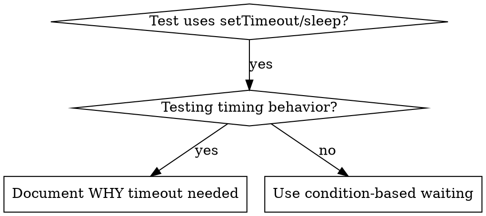

# 条件等待（Condition-Based Waiting）

## 概述

不稳定测试（Flaky tests）经常使用任意延迟（arbitrary delays）来猜测时机。这会产生竞态条件（race conditions），在快速机器上测试通过，但在负载下或在 CI 中失败。

**核心原则：** 等待你关心的实际条件（condition），而不是猜测需要多长时间。

## 使用时机



**使用时：**
- 测试包含任意延迟（`setTimeout`、`sleep`、`time.sleep()`）
- 测试不稳定（有时通过，在负载下失败）
- 测试并行运行时超时（timeout）
- 等待异步操作完成

**不要使用时：**
- 测试实际的时序行为（debounce、throttle 间隔）
- 如果使用任意超时，务必记录原因

## 核心模式

```typescript
// ❌ 之前：猜测时机
await new Promise(r => setTimeout(r, 50));
const result = getResult();
expect(result).toBeDefined();

// ✅ 之后：等待条件
await waitFor(() => getResult() !== undefined);
const result = getResult();
expect(result).toBeDefined();
```

## 常用模式

| 场景 | 模式 |
|------|------|
| 等待事件 | `waitFor(() => events.find(e => e.type === 'DONE'))` |
| 等待状态 | `waitFor(() => machine.state === 'ready')` |
| 等待计数 | `waitFor(() => items.length >= 5)` |
| 等待文件 | `waitFor(() => fs.existsSync(path))` |
| 复杂条件 | `waitFor(() => obj.ready && obj.value > 10)` |

## 实现

通用轮询（polling）函数：
```typescript
async function waitFor<T>(
  condition: () => T | undefined | null | false,
  description: string,
  timeoutMs = 5000
): Promise<T> {
  const startTime = Date.now();

  while (true) {
    const result = condition();
    if (result) return result;

    if (Date.now() - startTime > timeoutMs) {
      throw new Error(`Timeout waiting for ${description} after ${timeoutMs}ms`);
    }

    await new Promise(r => setTimeout(r, 10)); // 每 10ms 轮询一次
  }
}
```

有关包含领域特定助手函数（`waitForEvent`、`waitForEventCount`、`waitForEventMatch`）的完整实现，请参见此目录中的 `condition-based-waiting-example.ts`，该文件来自实际的调试会话。

## 常见错误

**❌ 轮询太快：** `setTimeout(check, 1)` - 浪费 CPU
**✅ 修复：** 每 10ms 轮询一次

**❌ 没有超时：** 条件永远不满足时会无限循环
**✅ 修复：** 始终包含超时并给出清晰的错误信息

**❌ 数据陈旧：** 在循环之前缓存状态
**✅ 修复：** 在循环内调用 getter 获取最新数据

## 何时任意超时是正确做法

```typescript
// 工具每 100ms 触发一次 - 需要 2 次触发来验证部分输出
await waitForEvent(manager, 'TOOL_STARTED'); // 首先：等待条件满足
await new Promise(r => setTimeout(r, 200));   // 然后：等待时序行为
// 200ms = 以 100ms 为间隔的 2 次触发 - 已记录并证明合理
```

**要求：**
1. 首先等待触发条件
2. 基于已知的时序（而不是猜测）
3. 添加注释说明原因

## 实际影响

来自调试会话（2025-10-03）：
- 修复了 3 个文件中的 15 个不稳定测试
- 通过率：60% → 100%
- 执行时间：快了 40%
- 不再有竞态条件
