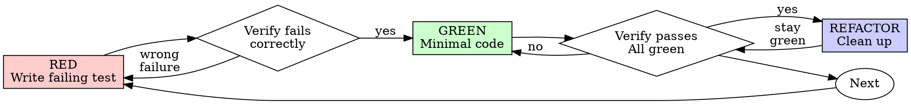

# 测试驱动开发（TDD）

## 概述

先写测试。观察它失败。编写最简代码使其通过。

**核心原则：** 如果你没看到测试失败，你就不知道它测试的是否正确。

**违反规则的文字就是违反规则的精神。**

## 何时使用

**始终使用：**
- 新功能
- Bug 修复
- 重构
- 行为变更

**例外情况（请询问你的 human partner（人类搭档））：**
- 一次性原型
- 生成的代码
- 配置文件

想着"就这一次跳过 TDD"？停下。那是自我合理化。

## The Iron Law（铁律）

```
NO PRODUCTION CODE WITHOUT A FAILING TEST FIRST
```

先写了代码？删掉它。重新开始。

**没有例外：**
- 不要留着当"参考"
- 不要在写测试时"改编"它
- 不要看它
- 删除就是删除

从头从测试开始实现。就这样。

## Red-Green-Refactor（红-绿-重构）



### RED（红）- 编写失败测试

编写一个最简测试，展示应该发生什么。

<Good>
```typescript
test('retries failed operations 3 times', async () => {
  let attempts = 0;
  const operation = () => {
    attempts++;
    if (attempts < 3) throw new Error('fail');
    return 'success';
  };

  const result = await retryOperation(operation);

  expect(result).toBe('success');
  expect(attempts).toBe(3);
});
```
清晰命名，测试真实行为，只测一件事
</Good>

<Bad>
```typescript
test('retry works', async () => {
  const mock = jest.fn()
    .mockRejectedValueOnce(new Error())
    .mockRejectedValueOnce(new Error())
    .mockResolvedValueOnce('success');
  await retryOperation(mock);
  expect(mock).toHaveBeenCalledTimes(3);
});
```
命名模糊，测试的是 mock 而不是代码
</Bad>

**要求：**
- 一种行为
- 清晰命名
- 真实代码（除非不可避免，否则不要用 mock）

### 验证 RED - 观察失败

**必须执行。绝不跳过。**

```bash
npm test path/to/test.test.ts
```

确认：
- 测试失败（而不是报错）
- 失败信息符合预期
- 失败是因为功能缺失（而不是拼写错误）

**测试通过了？** 你在测试已有行为。修正测试。

**测试报错了？** 修复错误，重新运行直到正确失败。

### GREEN（绿）- 最简代码

编写最简单的代码来通过测试。

<Good>
```typescript
async function retryOperation<T>(fn: () => Promise<T>): Promise<T> {
  for (let i = 0; i < 3; i++) {
    try {
      return await fn();
    } catch (e) {
      if (i === 2) throw e;
    }
  }
  throw new Error('unreachable');
}
```
刚好能通过
</Good>

<Bad>
```typescript
async function retryOperation<T>(
  fn: () => Promise<T>,
  options?: {
    maxRetries?: number;
    backoff?: 'linear' | 'exponential';
    onRetry?: (attempt: number) => void;
  }
): Promise<T> {
  // YAGNI
}
```
过度设计
</Bad>

不要添加功能、重构其他代码或"改进"超出测试范围。

### 验证 GREEN - 观察通过

**必须执行。**

```bash
npm test path/to/test.test.ts
```

确认：
- 测试通过
- 其他测试仍然通过
- 输出干净（无错误、无警告）

**测试失败了？** 修正代码，而不是测试。

**其他测试失败了？** 立即修复。

### REFACTOR（重构）- 清理代码

仅在绿灯后执行：
- 消除重复
- 改进命名
- 提取辅助函数

保持测试通过。不要新增行为。

### 重复

下一个功能的下一个失败测试。

## 好的测试

| 质量 | 好 | 差 |
|---------|------|-----|
| **最小化** | 只测一件事。名称中出现"and"？拆开。 | `test('validates email and domain and whitespace')` |
| **清晰** | 名称描述行为 | `test('test1')` |
| **展示意图** | 展示期望的 API | 掩盖代码应该做什么 |

## 为什么顺序很重要

**"我之后会补写测试来验证它是否工作"**

先写代码再补的测试会立刻通过。立刻通过证明不了什么：
- 可能测错了东西
- 可能测了实现而非行为
- 可能遗漏了你忘记的边界情况
- 你从未看到它捕获过 Bug

测试优先迫使你看到测试失败，证明它确实在测试某些东西。

**"我已经手动测试了所有边界情况"**

手动测试是临时的。你以为你测了全部，但：
- 没有测试记录
- 代码变化后无法重新运行
- 压力下容易忘记测试场景
- "我试过能跑"不等于全面覆盖

自动化测试是系统性的。它们每次都按相同方式运行。

**"删除 X 小时的工作是浪费"**

沉没成本谬误。时间已经花掉了。你现在可以选择：
- 删除并用 TDD 重写（再花 X 小时，高可靠性）
- 保留并在之后补测试（30 分钟，低可靠性，很可能有 Bug）

真正的"浪费"是保留你无法信任的代码。没有真正测试的可工作代码就是技术债务。

**"TDD 是教条的，务实意味着变通"**

TDD 本身就是务实的：
- 在提交前发现 Bug（比事后调试更快）
- 防止回归（测试立即捕获破坏）
- 记录行为（测试展示如何使用代码）
- 支持重构（自由修改，测试捕获破坏）

"务实"的捷径 = 在生产中调试 = 更慢。

**"之后补测试能达到同样的目标——这是精神而不是仪式"**

不。之后补测试回答的是"这段代码做了什么？"测试优先回答的是"这段代码应该做什么？"

之后补测试会受到你实现的偏差影响。你测试的是你构建的东西，而不是需求。你验证的是你记得的边界情况，而不是你发现的。

测试优先迫使你在实现之前发现边界情况。之后补测试验证的是你是否记得所有情况（你记不住的）。

30 分钟的之后补测试不等于 TDD。你得到了覆盖率，但失去了测试有效性的证明。

## 常见借口

| 借口 | 现实 |
|--------|---------|
| "太简单了不需要测试" | 简单的代码也会坏。测试只需 30 秒。 |
| "我之后会补测试" | 立刻通过的测试证明不了什么。 |
| "之后补测试能达到同样的目标" | 之后补测试 ="这段代码做了什么？" 测试优先 ="这段代码应该做什么？" |
| "已经手动测试过了" | 临时的 ≠ 系统的。没有记录，不能重新运行。 |
| "删除 X 小时是浪费" | 沉没成本谬误。保留未验证的代码就是技术债务。 |
| "留着当参考，先写测试" | 你会去改编它。那还是之后补测试。删除就是删除。 |
| "需要先探索一下" | 可以。扔掉探索代码，用 TDD 重新开始。 |
| "测试难写 = 设计不清晰" | 倾听测试。难测试 = 难使用。 |
| "TDD 会拖慢我" | TDD 比调试更快。务实 = 测试优先。 |
| "手动测试更快" | 手动测试无法证明边界情况。每次修改你都要重新测试。 |
| "已有代码没有测试" | 你正在改进它。为已有代码添加测试。 |

## 红旗警示 - 停止并重来

- 先写了代码
- 实现后才写测试
- 测试立即通过
- 无法解释测试为什么失败
- 测试"之后再补"
- 自我合理化"就这一次"
- "我已经手动测试过了"
- "之后补测试能达到同样的目的"
- "这是精神而不是仪式"
- "留着当参考"或"改编已有代码"
- "已经花了 X 小时，删掉是浪费"
- "TDD 是教条的，我是务实的"
- "这次不一样因为……"

**所有这些意味着：删除代码。用 TDD 重新开始。**

## 示例：修复 Bug

**Bug：** 空邮箱被接受

**RED（红）**
```typescript
test('rejects empty email', async () => {
  const result = await submitForm({ email: '' });
  expect(result.error).toBe('Email required');
});
```

**验证 RED**
```bash
$ npm test
FAIL: expected 'Email required', got undefined
```

**GREEN（绿）**
```typescript
function submitForm(data: FormData) {
  if (!data.email?.trim()) {
    return { error: 'Email required' };
  }
  // ...
}
```

**验证 GREEN**
```bash
$ npm test
PASS
```

**REFACTOR（重构）**
如果需要，提取验证逻辑以支持多个字段。

## 验证检查清单

在标记工作完成前：

- [ ] 每个新函数/方法都有测试
- [ ] 在实现前观察了每个测试失败
- [ ] 每个测试因预期原因失败（功能缺失，而非拼写错误）
- [ ] 编写了最简代码来通过每个测试
- [ ] 所有测试通过
- [ ] 输出干净（无错误、无警告）
- [ ] 测试使用真实代码（除非不可避免，否则不用 mock）
- [ ] 边界情况和错误已覆盖

无法勾选所有项？你跳过了 TDD。重新开始。

## 卡住时

| 问题 | 解决方案 |
|---------|----------|
| 不知道如何测试 | 编写期望的 API。先写断言。询问你的 human partner。 |
| 测试太复杂 | 设计太复杂。简化接口。 |
| 必须 mock 所有东西 | 代码耦合太紧。使用依赖注入。 |
| 测试设置代码太多 | 提取辅助函数。还是太复杂？简化设计。 |

## 调试集成

发现了 Bug？编写一个失败测试来复现它。遵循 TDD 循环。测试证明修复有效并防止回归。

绝不在没有测试的情况下修复 Bug。

## 测试反模式

在添加 mock 或测试工具时，阅读 [testing-anti-patterns.md](testing-anti-patterns.md) 以避免常见陷阱：
- 测试 mock 行为而非真实行为
- 在生产类中添加仅用于测试的方法
- 在不了解依赖的情况下使用 mock

## 最终规则

```
Production code → test exists and failed first
Otherwise → not TDD
```

未经你的 human partner 允许，没有例外。
