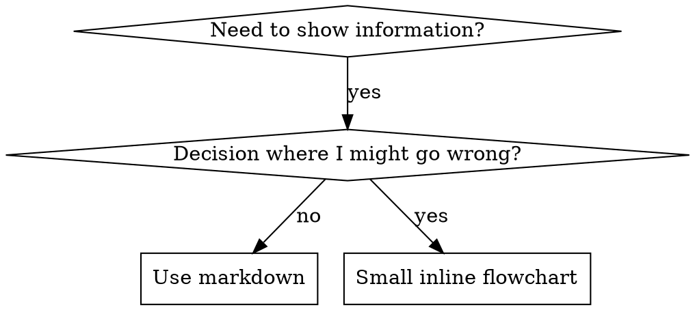

# 编写技能（Writing Skills）

## 概述

**编写技能就是将测试驱动开发应用于流程文档。**

**个人技能位于运行时的技能目录中**

你编写测试用例（带子代理的压力场景），观察它们失败（基线行为），编写技能（文档），观察测试通过（代理遵从），然后重构（堵住漏洞）。

**核心原则：** 如果你没有观察过代理在没有技能的情况下失败，你就不知道技能是否教会了正确的东西。

**必需背景：** 在使用此技能之前，你必须理解 superpowers:test-driven-development。该技能定义了基本的 RED-GREEN-REFACTOR（红-绿-重构）周期。此技能将 TDD 适配到文档。

**官方指南：** 关于 Anthropic 的官方技能编写最佳实践，请参阅 anthropic-best-practices.md。本文档提供了补充此技能中 TDD 聚焦方法的额外模式和指南。

## 什么是技能？

**技能**是针对经过验证的技术、模式或工具的参考指南。技能帮助未来的代理找到并应用有效的方法。

**技能是：** 可重用的技术、模式、工具、参考指南

**技能不是：** 关于你曾经如何解决某个问题的叙述

## 技能的 TDD 映射

| TDD 概念 | 技能创建 |
|-------------|----------------|
| **测试用例** | 带子代理的压力场景 |
| **生产代码** | 技能文档（SKILL.md） |
| **测试失败（RED）** | 代理在没有技能的情况下违反规则（基线） |
| **测试通过（GREEN）** | 代理在有技能的情况下遵从 |
| **重构** | 堵住漏洞，同时保持遵从性 |
| **先写测试** | 在编写技能之前运行基线场景 |
| **观察失败** | 记录代理使用的确切合理化说辞 |
| **最小代码** | 编写技能，针对那些特定的违规行为 |
| **观察通过** | 验证代理现在遵从 |
| **重构周期** | 发现新的合理化说辞 → 堵住 → 重新验证 |

整个技能创建过程遵循 RED-GREEN-REFACTOR。

## 何时创建技能

**创建时机：**
- 该技术对你来说并非直观明显
- 你会跨项目再次引用它
- 模式适用范围广泛（非项目特定）
- 其他人会受益

**不要为以下情况创建：**
- 一次性解决方案
- 其他地方已有完善文档的标准实践
- 项目特定的约定（放到你的指令文件中）
- 机械性约束（如果可以用正则表达式/验证来强制执行，就自动化——将文档留给需要判断的内容）

## 技能类型

### 技术（Technique）
具有可遵循步骤的具体方法（condition-based-waiting、root-cause-tracing）

### 模式（Pattern）
思考问题的方式（flatten-with-flags、test-invariants）

### 参考（Reference）
API文档、语法指南、工具文档（office docs）

## 目录结构

```
skills/
  skill-name/
    SKILL.md              # 主参考文件（必需）
    supporting-file.*     # 仅在需要时
```

**扁平命名空间** - 所有技能都在一个可搜索的命名空间中

**单独文件适用于：**
1. **重型参考**（100+行）- API文档、综合语法
2. **可重用工具** - 脚本、实用程序、模板

**内联保留：**
- 原则和概念
- 代码模式（少于50行）
- 其他所有内容

## SKILL.md 结构

**前置元数据（YAML）：**
- 两个必需字段：`name` 和 `description`（有关所有支持的字段，请参阅 [agentskills.io/specification](https://agentskills.io/specification)）
- 总计最多1024个字符
- `name`：仅使用字母、数字和连字符（无括号、特殊字符）
- `description`：第三人称，仅描述何时使用（非做什么）
  - 以"Use when..."开头，聚焦于触发条件
  - 包含具体症状、情况和上下文
  - **切勿总结技能的过程或工作流程**（参见 SDO 部分了解原因）
  - 尽可能保持在500字符以内

```markdown
---
name: Skill-Name-With-Hyphens
description: Use when [specific triggering conditions and symptoms]
---

# Skill Name

## Overview
What is this? Core principle in 1-2 sentences.

## When to Use
[Small inline flowchart IF decision non-obvious]

Bullet list with SYMPTOMS and use cases
When NOT to use

## Core Pattern (for techniques/patterns)
Before/after code comparison

## Quick Reference
Table or bullets for scanning common operations

## Implementation
Inline code for simple patterns
Link to file for heavy reference or reusable tools

## Common Mistakes
What goes wrong + fixes

## Real-World Impact (optional)
Concrete results
```

## 技能发现优化（SDO）

**对发现至关重要：** 未来的代理需要找到你的技能

### 1. 丰富的描述字段

**目的：** 你的代理读取描述以决定为给定任务加载哪些技能。让它回答："我现在应该阅读这个技能吗？"

**格式：** 以"Use when..."开头，聚焦于触发条件

**关键：描述 = 何时使用，而非技能做什么**

描述应仅描述触发条件。不要在描述中总结技能的过程或工作流程。

**为什么这很重要：** 测试发现，当描述总结了技能的工作流程时，代理可能会遵循描述而不是阅读完整的技能内容。一个说"task之间的code review"的描述导致代理只做了一次审查，即使技能的流程图清楚地显示了两次审查（先规格遵从性，后代码质量）。

当描述改为仅"在执行包含独立任务的实施计划时使用"（无工作流程总结）时，代理正确阅读了流程图并遵循了两阶段审查流程。

**陷阱：** 总结工作流程的描述创造了代理会采取的捷径。技能正文变成了代理跳过的文档。

```yaml
# 错误：总结了工作流程——代理可能遵循此描述而非阅读技能
description: Use when executing plans - dispatches subagent per task with code review between tasks

# 错误：过程细节太多
description: Use for TDD - write test first, watch it fail, write minimal code, refactor

# 正确：仅触发条件，无工作流程总结
description: Use when executing implementation plans with independent tasks in the current session

# 正确：仅触发条件
description: Use when implementing any feature or bugfix, before writing implementation code
```

**内容：**
- 使用具体的触发器、症状和情境来表明此技能适用
- 描述*问题*（竞态条件、不一致行为）而非*语言特定的症状*（setTimeout、sleep）
- 保持触发器技术中立，除非技能本身是技术特定的
- 如果技能是技术特定的，在触发器中明确说明
- 以第三人称编写（注入到系统提示中）
- **切勿总结技能的过程或工作流程**

```yaml
# 错误：过于抽象、模糊，不包含何时使用
description: For async testing

# 错误：第一人称
description: I can help you with async tests when they're flaky

# 错误：提及了技术但技能并非特定于此技术
description: Use when tests use setTimeout/sleep and are flaky

# 正确：以"Use when"开头，描述问题，无工作流程
description: Use when tests have race conditions, timing dependencies, or pass/fail inconsistently

# 正确：技术特定的技能，带有明确的触发器
description: Use when using React Router and handling authentication redirects
```

### 2. 关键词覆盖

使用代理会搜索的词：
- 错误消息："Hook timed out"、"ENOTEMPTY"、"race condition"
- 症状："flaky"、"hanging"、"zombie"、"pollution"
- 同义词："timeout/hang/freeze"、"cleanup/teardown/afterEach"
- 工具：实际命令、库名称、文件类型

### 3. 描述性命名

**使用主动语态，动词优先：**
- 正确 `creating-skills` 而非 `skill-creation`
- 正确 `condition-based-waiting` 而非 `async-test-helpers`

### 4. 令牌效率（关键）

**问题：** 入门指南和常被引用的技能会加载到每次对话中。每个令牌都重要。

**目标词数：**
- 入门指南工作流程：每个少于150词
- 常加载的技能：总计少于200词
- 其他技能：少于500词（仍需简洁）

**技巧：**

**将详细信息移至工具帮助：**
```bash
# 错误：在 SKILL.md 中记录所有标志
search-conversations supports --text, --both, --after DATE, --before DATE, --limit N

# 正确：引用 --help
search-conversations supports multiple modes and filters. Run --help for details.
```

**使用交叉引用：**
```markdown
# 错误：重复工作流程细节
When searching, dispatch subagent with template...
[20 lines of repeated instructions]

# 正确：引用其他技能
Always use subagents (50-100x context savings). REQUIRED: Use [other-skill-name] for workflow.
```

**压缩示例：**
```markdown
# 错误：冗长的示例（42词）
your human partner: "How did we handle authentication errors in React Router before?"
You: I'll search past conversations for React Router authentication patterns.
[Dispatch subagent with search query: "React Router authentication error handling 401"]

# 正确：最小示例（20词）
Partner: "How did we handle auth errors in React Router?"
You: Searching...
[Dispatch subagent → synthesis]
```

**消除冗余：**
- 不要重复交叉引用技能中已有的内容
- 不要解释从命令中显而易见的内容
- 不要包含同一模式的多个示例

**验证：**
```bash
wc -w skills/path/SKILL.md
# getting-started workflows: aim for <150 each
# Other frequently-loaded: aim for <200 total
```

**按你所做的或核心洞察来命名：**
- 正确 `condition-based-waiting` > `async-test-helpers`
- 正确 `using-skills` 而非 `skill-usage`
- 正确 `flatten-with-flags` > `data-structure-refactoring`
- 正确 `root-cause-tracing` > `debugging-techniques`

**动名词（-ing）对流程很有效：**
- `creating-skills`、`testing-skills`、`debugging-with-logs`
- 主动语态，描述你正在采取的行动

### 5. 交叉引用其他技能

**在编写引用其他技能文档时：**

仅使用技能名称，附带明确的必需标记：
- 正确：`**REQUIRED SUB-SKILL:** Use superpowers:test-driven-development`
- 正确：`**REQUIRED BACKGROUND:** You MUST understand superpowers:systematic-debugging`
- 错误：`See skills/testing/test-driven-development`（不清楚是否必需）
- 错误：`@skills/testing/test-driven-development/SKILL.md`（强制加载，消耗上下文）

**为什么不用@链接：** `@` 语法立即强制加载文件，在你需要它们之前就消耗了200k+上下文。

## 流程图使用



**仅在以下情况使用流程图：**
- 非显而易见的决策点
- 可能过早停止的流程循环
- "何时使用A与B"的决策

**永远不要将流程图用于：**
- 参考材料 → 表格、列表
- 代码示例 → Markdown 代码块
- 线性指令 → 编号列表
- 没有语义含义的标签（step1、helper2）

参见此目录中的 `graphviz-conventions.dot` 了解 graphviz 样式规则。

**为你的 human partner（人类搭档）可视化：** 使用此目录中的 `render-graphs.js` 将技能的流程图渲染为 SVG：
```bash
./render-graphs.js ../some-skill           # 每个图表单独渲染
./render-graphs.js ../some-skill --combine # 所有图表合并在一个SVG中
```

## 代码示例

**一个优秀的示例胜过许多平庸的示例**

选择最相关的语言：
- 测试技术 → TypeScript/JavaScript
- 系统调试 → Shell/Python
- 数据处理 → Python

**好的示例：**
- 完整且可运行
- 注释充分，解释为什么
- 来自真实场景
- 清晰展示模式
- 可直接适配（不是通用模板）

**不要：**
- 用5种以上语言实现
- 创建填空模板
- 编写刻意编造的示例

你擅长移植——一个优秀的示例就足够了。

## 文件组织

### 自包含技能
```
defense-in-depth/
  SKILL.md    # 所有内容内联
```
何时：所有内容都放得下，无需重型参考

### 带有可重用工具的技能
```
condition-based-waiting/
  SKILL.md    # 概览 + 模式
  example.ts  # 可供适配的工作辅助工具
```
何时：工具是可重用的代码，而不仅仅是叙述

### 带有重型参考的技能
```
pptx/
  SKILL.md       # 概览 + 工作流程
  pptxgenjs.md   # 600行API参考
  ooxml.md       # 500行XML结构
  scripts/       # 可执行工具
```
何时：参考材料太大，不适合内联

## 铁律（The Iron Law）(与TDD相同)

```
无测试失败的技能——不存在的技能
```

这适用于新技能和对现有技能的修改。

先写技能再测试？删除它。重新开始。
不经测试就修改技能？同样的违规。

**无例外：**
- 不要因为"简单添加"而例外
- 不要因为"只是加个章节"而例外
- 不要因为"文档更新"而例外
- 不要保留未经测试的变更作为"参考"
- 不要在运行测试时"适配"
- 删除就是删除

**必需背景：** superpowers:test-driven-development 技能解释了为什么这很重要。同样的原则适用于文档。

## 测试所有技能类型

不同的技能类型需要不同的测试方法：

### 纪律执行型技能（规则/要求）

**示例：** TDD、verification-before-completion、designing-before-coding

**测试方法：**
- 学术问题：他们理解规则吗？
- 压力场景：他们在压力下会遵从吗？
- 多重压力组合：时间 + 沉没成本 + 疲惫
- 识别合理化说辞并添加明确的反驳

**成功标准：** 代理在最大压力下遵循规则

### 技术型技能（操作指南）

**示例：** condition-based-waiting、root-cause-tracing、defensive-programming

**测试方法：**
- 应用场景：他们能正确应用该技术吗？
- 变体场景：他们能处理边界情况吗？
- 信息缺失测试：指令是否有空白？
- 成功标准：代理成功将技术应用于新场景

**成功标准：** 代理成功将技术应用于新场景

### 模式型技能（心智模型）

**示例：** reducing-complexity、information-hiding concepts

**测试方法：**
- 识别场景：他们能识别何时该模式适用吗？
- 应用场景：他们能使用心智模型吗？
- 反例：他们知道何时不适用吗？

**成功标准：** 代理正确识别何时/如何应用模式

### 参考型技能（文档/API）

**示例：** API文档、命令参考、库指南

**测试方法：**
- 检索场景：他们能找到正确的信息吗？
- 应用场景：他们能正确使用找到的内容吗？
- 空白测试：常见用例是否都覆盖到了？

**成功标准：** 代理找到并正确应用参考信息

## 跳过测试的常见合理化说辞

| 借口 | 现实 |
|--------|---------|
| "技能显然很清楚" | 对你清楚≠对其他代理清楚。测试它。 |
| "这只是个参考" | 参考可能有空白、不清晰的章节。测试检索。 |
| "测试太小题大做了" | 未经测试的技能都有问题，无一例外。15分钟测试节省数小时。 |
| "有问题再说" | 问题 = 代理无法使用技能。在部署前测试。 |
| "测试太繁琐了" | 测试比在生产中调试糟糕的技能更不繁琐。 |
| "我有信心它很好" | 过度自信保证出问题。无论如何都要测试。 |
| "学术评审就够了" | 阅读≠使用。测试应用场景。 |
| "没时间测试" | 部署未经测试的技能后续修复会浪费更多时间。 |

**所有这些都意味着：部署前测试。无例外。**

## 匹配形式与失败类型

在编写指导之前，先对基线失败进行分类。对一种失败类型有效加固的形式，可能对另一种失败类型适得其反。

| 基线失败 | 正确形式 | 错误形式 |
|---|---|---|
| 在压力下跳过/违反规则（明知故犯） | 禁止 + 合理化表格 + 红旗（见下方加固部分） | 软性指导（"建议..."、"考虑..."） |
| 遵从了，但输出形态错误（提示过于冗长、结论被埋没、复述规格） | 阳性配方或契约：说明输出应该是什么——它的组成部分、按顺序 | 禁止列表（"不要复述"、"永远不要叙述"） |
| 遗漏了他们已经在产出的内容中的必需元素 | 结构性：模板中的必需字段或插槽 | 模板附近的大段文字提醒 |
| 行为应取决于某个条件 | 以可观察谓词为键的条件语句（"如果简述存在，引用它"） | 无条件规则 + 豁免条款 |

**为什么禁止在形态塑造问题上适得其反：** 在竞争性激励下（"让提示独立完整"），代理会与"不要做X"讨价还价。在分发提示指导的措辞对比测试中，禁止组产生的不良内容明显多于配方组（完全分离的分布），甚至比无指导对照组更差——请微观测试你自己的案例而不是假设，但永远不要默认选择禁止。配方没有任何可谈判的余地：输出要么匹配所述形态，要么不匹配。

**无论选择哪种形式的规则：**
- **没有模糊条款。** "除非重要，否则不要做X"重新打开了谈判——在同一个措辞测试中，给一个成功的配方附加一个模糊条款就将其从一致退化为有噪音。将真正的例外表达为基于可观察谓词的独立条件语句。
- **豁免条款不会划定范围。** "此限制不适用于代码块"仍然会抑制代码块。如果输出的某部分必须豁免，重新结构化使规则无法触及它。

## 防代理合理化加固

执行纪律的技能（如TDD）需要抵抗合理化说辞。代理很聪明，在压力下会找到漏洞。

**范围：** 此工具包适用于纪律失败——代理知道规则但在压力下跳过它。对于形态错误或遗漏元素的情况，基于禁止的加固会适得其反；请使用"匹配形式与失败类型"中的形式。

**心理学备注：** 理解为什么说服技巧有效，有助于你系统地应用它们。请参阅 persuasion-principles.md 了解研究基础（Cialdini, 2021; Meincke et al., 2025），涵盖权威、承诺、稀缺性、社会认同和一致性原则。

### 明确堵住每个漏洞

不要仅仅陈述规则——禁止具体的变通方法：

<Bad>
```markdown
Write code before test? Delete it.
```
</Bad>

<Good>
```markdown
Write code before test? Delete it. Start over.

**No exceptions:**
- Don't keep it as "reference"
- Don't "adapt" it while writing tests
- Don't look at it
- Delete means delete
```
</Good>

### 应对"精神与字面"的争论

尽早加入基本原则：

```markdown
**Violating the letter of the rules is violating the spirit of the rules.**
```

这切断了一整类"我在遵循精神"的合理化说辞。

### 建立合理化表格

从基线测试中捕获合理化说辞（见下方测试部分）。代理用的每一个借口都要放入表格：

```markdown
| Excuse | Reality |
|--------|---------|
| "Too simple to test" | Simple code breaks. Test takes 30 seconds. |
| "I'll test after" | Tests passing immediately prove nothing. |
| "Tests after achieve same goals" | Tests-after = "what does this do?" Tests-first = "what should this do?" |
```

### 创建红旗列表

让代理在合理化时易于自我检查：

```markdown
## Red Flags - STOP and Start Over

- Code before test
- "I already manually tested it"
- "Tests after achieve the same purpose"
- "It's about spirit not ritual"
- "This is different because..."

**All of these mean: Delete code. Start over with TDD.**
```

### 为违规症状更新SDO

在描述中添加：当你即将违反规则时的症状：

```yaml
description: use when implementing any feature or bugfix, before writing implementation code
```

## 技能的 RED-GREEN-REFACTOR

遵循 TDD 周期：

### RED：编写失败测试（基线）

在没有技能的情况下，用子代理运行压力场景。记录确切行为：
- 他们做了哪些选择？
- 他们用了哪些合理化说辞（逐字记录）？
- 哪些压力触发了违规？

这是"观察测试失败"——你必须在编写技能之前看到代理自然的行为。

### GREEN：编写最小技能

编写技能，针对那些特定的合理化说辞。不要为假设性案例添加额外内容。

在相同场景下运行带有技能的情况。代理现在应该遵从。

### REFACTOR：堵住漏洞

代理发现了新的合理化说辞？添加明确的驳斥。重新测试直到固若金汤。

### 在完整场景前进行微措辞测试

完整的压力场景运行是最终关口，但它们每次迭代都很慢且昂贵。首先用微测试验证措辞本身：

1. **每次调用一个新鲜上下文样本** — 一个原始API调用，或者如果你没有API访问权限，一个一次性子代理。系统提示 = 指导所处的真实上下文（完整的技能或提示模板，而非孤立的指导）；用户消息 = 一个引诱失败的任务。
2. **始终包含一个无指导对照组。** 如果对照组没有表现出失败，那就没什么需要修复的——停下来，不要编写指导。
3. **每个变体至少5次重复。** 单一样本会撒谎。
4. **手动阅读每个被标记的匹配。** 如果你愿意，可以用程序评分，但模板回显和引用的反例会伪装成命中；仅靠自动化计数会高估失败和成功。
5. **方差是一个指标。** 当指导有效时，重复会收敛到相同的形态。五次重复中有五种不同的解释意味着措辞没有约束力——在添加文字之前收紧形式。

微测试验证措辞；它们不能替代纪律型技能的压力场景。

**测试方法论：** 参见 [testing-skills-with-subagents.md](testing-skills-with-subagents.md) 了解完整的测试方法论：
- 如何编写压力场景
- 压力类型（时间、沉没成本、权威、疲惫）
- 系统地堵住漏洞
- 元测试技术

## 反模式

### 叙述性示例
"In session 2025-10-03, we found empty projectDir caused..."
**为什么不好：** 过于具体，不可重用

### 多语言稀释
example-js.js, example-py.py, example-go.go
**为什么不好：** 质量平庸，维护负担

### 流程图中的代码
```dot
step1 [label="import fs"];
step2 [label="read file"];
```
**为什么不好：** 无法复制粘贴，难以阅读

### 通用标签
helper1, helper2, step3, pattern4
**为什么不好：** 标签应有语义含义

## 停止：在进入下一个技能之前

**在编写任何技能之后，你必须停止并完成部署流程。**

**不要：**
- 批量创建多个技能而不测试每个
- 在当前技能验证之前进入下一个技能
- 因为"批量更高效"而跳过测试

**下面的部署检查清单对每个技能都是强制的。**

部署未经测试的技能 = 部署未经测试的代码。这是违反质量标准的。

## 技能创建检查清单（TDD适配版）

**重要提示：为下方每个检查清单项创建一个待办事项。**

**RED阶段 - 编写失败测试：**
- [ ] 创建压力场景（纪律型技能需要3种以上组合压力）
- [ ] 在没有技能的情况下运行场景——逐字记录基线行为
- [ ] 识别合理化说辞/失败的模式

**GREEN阶段 - 编写最小技能：**
- [ ] 名称仅使用字母、数字、连字符（无括号/特殊字符）
- [ ] YAML 前置元数据包含必需的 `name` 和 `description` 字段（最多1024个字符；参见 [规格](https://agentskills.io/specification)）
- [ ] 描述以"Use when..."开头并包含具体触发器/症状
- [ ] 描述以第三人称编写
- [ ] 全文包含关键词以便搜索（错误、症状、工具）
- [ ] 清晰的概览，包含核心原则
- [ ] 针对RED阶段识别的特定基线失败
- [ ] 指导形式与失败类型匹配（参见"匹配形式与失败类型"）
- [ ] 对于行为塑造指导：措辞经过微测试，有对照组（5次以上重复，每个被标记的匹配手动阅读）——纯参考技能不适用
- [ ] 代码内联或链接到单独文件
- [ ] 一个优秀的示例（非多语言）
- [ ] 在带有技能的情况下运行场景——验证代理现在遵从

**REFACTOR阶段 - 堵住漏洞：**
- [ ] 从测试中识别新的合理化说辞
- [ ] 添加明确的驳斥（如果是纪律型技能）
- [ ] 从所有测试迭代中建立合理化表格
- [ ] 创建红旗列表
- [ ] 重新测试直到固若金汤

**质量检查：**
- [ ] 仅当决策非显而易见时使用小型流程图
- [ ] 快速参考表格
- [ ] 常见错误章节
- [ ] 没有叙述性故事
- [ ] 仅当需要工具或重型参考时使用支持文件

**部署：**
- [ ] 将技能提交到 git 并推送到你的分支（如果已配置）
- [ ] 考虑通过 PR 贡献回上游（如果广泛有用）

## 发现工作流

未来的代理如何找到你的技能：

1. **遇到问题**（"tests are flaky"）
2. **搜索技能**（grep描述，浏览分类）
3. **找到技能**（描述匹配）
4. **扫描概览**（这相关吗？）
5. **阅读模式**（快速参考表格）
6. **加载示例**（仅在实施时）

**针对此流程优化** - 尽早并经常放置可搜索的术语。

## 结论

**创建技能就是对流程文档进行TDD。**

相同的 The Iron Law（铁律）：没有测试失败的技能就是不存在。
相同的周期：RED（基线）→ GREEN（编写技能）→ REFACTOR（堵住漏洞）。
相同的好处：更高质量、更少意外、固若金汤的结果。

如果你为代码遵循TDD，那就为技能也遵循它。这是应用于文档的同一纪律。
